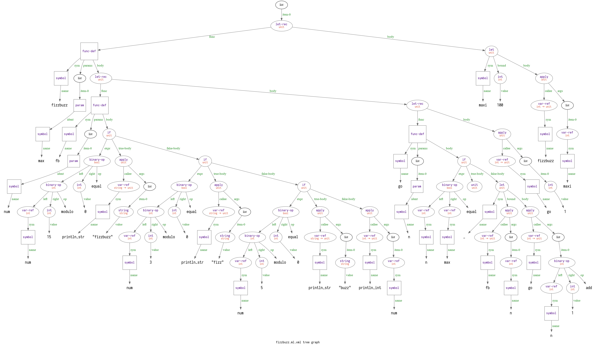

# mly

An WIP compiler for a [minimal subset of OCaml](https://github.com/esumii/min-caml/), written in C. Based heavily on the awesome [gocaml](rhysd/gocaml).

Uses Ragel for lexing, Lemon for parsing, BDW-GC for garbage collection 

So far it is able to parse and type check the following code

```ocaml
let rec fizzbuzz max =
    let rec fb num =
        if num % 15 = 0 then println_str "fizzbuzz" else
        if num % 3  = 0 then println_str "fizz" else
        if num % 5  = 0 then println_str "buzz" else
        println_int num
    in
    let rec go n =
        if n = max then () else
        (fb n; go (n + 1))
    in
    go 1
in
let maxi = 100 in
fizzbuzz maxi
```

and generate




## Building

```shell 
mkdir build && cd build
cmake -DCMAKE_CXX_COMPILER=clang .. 
make 
``` 

